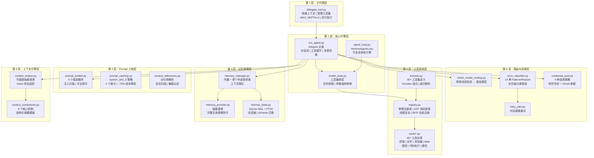
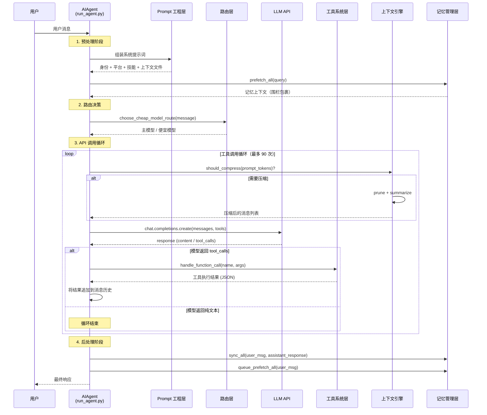
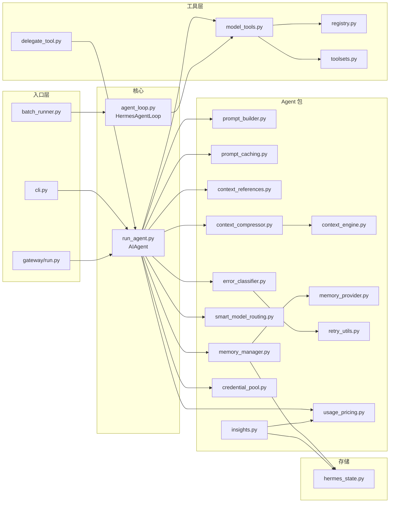

# Ch0: 整体架构概览

## 概述

hermes-agent 是由 Nous Research 开发的开源 AI Agent 框架，支持多模型提供商（Anthropic、OpenAI、Google、DeepSeek、本地模型等）、多平台（CLI、Telegram、Discord、WhatsApp、Slack、Email 等）和多工具（40+ 内置工具）的智能对话系统。

从架构角度看，hermes-agent 采用**七层分层架构**，每一层职责明确、接口清晰，层与层之间通过定义良好的数据流进行通信。这种分层设计使得各层可以独立演进——例如，可以替换上下文引擎而不影响工具系统，或者添加新的记忆提供者而不修改核心引擎。

本章提供整体架构的鸟瞰视图，后续章节将逐层深入分析。

## 源码分析

### 七层架构总览

hermes-agent 的七层架构从底层到顶层依次为：

| 层次 | 名称 | 核心职责 | 关键源码文件 |
|------|------|----------|-------------|
| 第 1 层 | 核心引擎层 (Core Engine) | 对话流管理、工具执行循环、异步桥接 | `run_agent.py`, `environments/agent_loop.py`, `model_tools.py` |
| 第 2 层 | Prompt 工程层 (Prompt Engineering) | 系统提示词组装、提示缓存、@引用解析 | `agent/prompt_builder.py`, `agent/prompt_caching.py`, `agent/context_references.py` |
| 第 3 层 | 上下文引擎层 (Context Engine) | 上下文窗口管理、自动压缩、token 预算 | `agent/context_engine.py`, `agent/context_compressor.py` |
| 第 4 层 | 记忆管理层 (Memory Management) | 跨会话记忆、状态持久化、记忆提供者编排 | `agent/memory_manager.py`, `agent/memory_provider.py`, `hermes_state.py` |
| 第 5 层 | 工具系统层 (Tool System) | 工具注册、工具集组合、工具调用分发 | `tools/registry.py`, `toolsets.py`, `model_tools.py`, `tools/*.py` |
| 第 6 层 | 路由与容错层 (Routing & Resilience) | 智能模型路由、错误分类、重试策略、凭证轮换 | `agent/smart_model_routing.py`, `agent/error_classifier.py`, `agent/retry_utils.py`, `agent/credential_pool.py` |
| 第 7 层 | 子代理层 (Sub-Agent) | 任务委托、隔离执行、并行协作 | `tools/delegate_tool.py` |

---

### 第 1 层：核心引擎层 (Core Engine)

**源码文件**：
- `hermes-agent/run_agent.py` — `AIAgent` 主类，12000+ 行，是整个框架的入口和编排中心
- `hermes-agent/environments/agent_loop.py` — `HermesAgentLoop`，可复用的多轮工具调用引擎
- `hermes-agent/model_tools.py` — 工具编排层，连接模型调用与工具注册表

**核心职责**：

`AIAgent` 类是 hermes-agent 的心脏。它负责：
- **对话流管理**：维护消息历史（OpenAI 格式），处理用户输入和模型响应
- **工具执行循环**：检测模型返回的 `tool_calls`，分发到对应工具，将结果回传模型，循环直到模型自然停止或达到最大迭代次数（默认 90 次）
- **多提供商适配**：通过 `api_mode` 支持 Chat Completions、Codex Responses、Anthropic Messages、Bedrock Converse 等多种 API 格式
- **会话生命周期**：创建会话、持久化消息、管理 token 计数、成本估算

`HermesAgentLoop` 是一个独立的多轮工具调用引擎，用于 RL 训练环境和评估场景。它实现了与 `AIAgent` 相同的工具调用循环模式，但更加轻量：
- 使用 `AgentResult` 数据类封装执行结果（消息历史、轮次数、是否自然完成、推理内容、工具错误）
- 使用 `ToolError` 记录每次工具执行失败的详细信息
- 通过 `ThreadPoolExecutor` 在独立线程中执行工具调用，避免异步事件循环死锁

`model_tools.py` 是工具系统的编排层：
- `get_tool_definitions()` — 根据启用/禁用的工具集，从注册表获取 OpenAI 格式的工具 schema
- `handle_function_call()` — 工具调用分发器，包含参数类型强制转换（LLM 常将数字返回为字符串）
- `_run_async()` — 异步桥接函数，使用持久事件循环避免 "Event loop is closed" 错误

---

### 第 2 层：Prompt 工程层 (Prompt Engineering)

**源码文件**：
- `hermes-agent/agent/prompt_builder.py` — 模块化系统提示词组装
- `hermes-agent/agent/prompt_caching.py` — Anthropic 提示缓存策略
- `hermes-agent/agent/context_references.py` — @引用解析和安全扫描

**核心职责**：

`prompt_builder.py` 将系统提示词拆分为多个独立模块，按需组装：
- **身份提示** (`DEFAULT_AGENT_IDENTITY`)：定义 Agent 的角色和行为准则
- **平台提示** (`PLATFORM_HINTS`)：根据运行平台（CLI、Telegram、WhatsApp 等 15+ 平台）注入格式化指导
- **技能索引** (`build_skills_system_prompt`)：扫描 `~/.hermes/skills/` 目录，构建技能清单（含两层缓存：进程内 LRU + 磁盘快照）
- **上下文文件** (`build_context_files_prompt`)：加载 `.hermes.md`、`AGENTS.md` 等项目级指令文件
- **提示注入扫描** (`_scan_context_content`)：对上下文文件进行 10 种威胁模式匹配和不可见 Unicode 字符检测

`prompt_caching.py` 实现了 Anthropic 的 `system_and_3` 缓存策略：
- 使用 4 个 `cache_control` 断点（Anthropic 最大允许数）
- 第 1 个断点放在系统提示词（跨轮次稳定）
- 第 2-4 个断点放在最后 3 条非系统消息（滚动窗口）
- 可降低约 75% 的输入 token 成本

`context_references.py` 实现了 `@引用` 语法解析：
- 支持 `@file:path`、`@folder:path`、`@diff`、`@staged`、`@git:N`、`@url:URL` 等引用类型
- 对文件引用进行安全检查：阻止访问 `.ssh`、`.aws`、`.gnupg` 等敏感目录和 `id_rsa`、`.env`、`credentials` 等敏感文件
- 实施 token 注入限制：硬限制为上下文窗口的 50%，软限制为 25%

---

### 第 3 层：上下文引擎层 (Context Engine)

**源码文件**：
- `hermes-agent/agent/context_engine.py` — 可插拔上下文引擎抽象基类
- `hermes-agent/agent/context_compressor.py` — 默认压缩器实现

**核心职责**：

`ContextEngine` 是一个抽象基类，定义了上下文管理的标准接口：
- `update_from_response(usage)` — 从 API 响应更新 token 使用量
- `should_compress(prompt_tokens)` — 判断是否需要触发压缩
- `compress(messages, current_tokens)` — 执行压缩，返回新的消息列表
- 维护 token 状态：`last_prompt_tokens`、`threshold_tokens`、`context_length`、`compression_count`

`ContextCompressor` 是默认实现，采用五个核心机制：
1. **保护头尾消息**：保护前 N 条消息（系统提示 + 首轮对话）和尾部 token 预算内的消息
2. **摘要中间轮次**：使用辅助模型（便宜/快速）对中间轮次生成结构化摘要
3. **迭代摘要更新**：多次压缩时，在前一次摘要基础上增量更新，而非从头生成
4. **工具输出预剪枝**：在 LLM 摘要之前，先用规则将大型工具输出替换为信息丰富的单行摘要
5. **按比例分配摘要预算**：摘要 token 预算与被压缩内容量成正比（20% 比例，上限为上下文窗口的 5%）

摘要模板采用"交接"框架（handoff framing），包含 Active Task、Completed Actions、Active State、Resolved/Pending Questions 等结构化字段。

---

### 第 4 层：记忆管理层 (Memory Management)

**源码文件**：
- `hermes-agent/agent/memory_manager.py` — 记忆编排器
- `hermes-agent/agent/memory_provider.py` — 记忆提供者抽象基类
- `hermes-agent/hermes_state.py` — SQLite 状态存储

**核心职责**：

`MemoryManager` 采用"内置 + 单个外部"的组合模式：
- 内置提供者（`BuiltinMemoryProvider`）始终存在，管理 `MEMORY.md` 和 `USER.md`
- 最多允许一个外部提供者（Honcho、Hindsight、Mem0 等），防止工具 schema 膨胀和后端冲突
- 提供上下文围栏机制：`sanitize_context()` 清理围栏标签，`build_memory_context_block()` 用 `<memory-context>` 标签和系统注释包裹记忆内容，防止模型将记忆误认为用户输入

`MemoryProvider` 抽象基类定义了完整的生命周期：
- **核心钩子**：`initialize()`、`prefetch()`、`sync_turn()`、`shutdown()`
- **可选钩子**：`on_turn_start()`、`on_session_end()`、`on_pre_compress()`、`on_memory_write()`、`on_delegation()`
- 每个钩子的失败不会阻塞其他提供者（容错隔离）

`hermes_state.py` 的 `SessionDB` 类提供 SQLite 持久化：
- **WAL 模式**：支持并发读写（多平台网关场景）
- **FTS5 全文搜索**：对消息内容建立全文索引，支持跨会话搜索
- **会话链**：通过 `parent_session_id` 实现压缩触发的会话分裂和子代理会话关联
- **Schema 版本管理**：当前版本 6，支持增量迁移
- **写入竞争处理**：应用层随机抖动重试（20-150ms），替代 SQLite 内置的确定性退避，避免护航效应

---

### 第 5 层：工具系统层 (Tool System)

**源码文件**：
- `hermes-agent/tools/registry.py` — 单例工具注册表
- `hermes-agent/toolsets.py` — 工具集定义和组合
- `hermes-agent/model_tools.py` — 工具编排层
- `hermes-agent/tools/*.py` — 40+ 工具实现文件

**核心职责**：

`ToolRegistry` 是一个线程安全的单例注册表：
- 每个工具通过 `ToolEntry` 记录元数据：名称、工具集、schema、处理函数、可用性检查函数、emoji 等
- 使用 AST 静态分析（`_module_registers_tools`）自动发现包含 `registry.register()` 调用的工具模块
- 支持 MCP 动态工具注册和注销（`deregister()`），使用 `RLock` 保证线程安全
- 提供 `get_definitions()` 方法，只返回通过 `check_fn()` 可用性检查的工具 schema

`toolsets.py` 定义了工具集的组合机制：
- `_HERMES_CORE_TOOLS` 列表定义了所有平台共享的核心工具（约 30 个）
- `TOOLSETS` 字典定义了 30+ 工具集，支持 `includes` 字段实现工具集组合
- `resolve_toolset()` 递归解析工具集，处理循环依赖和菱形依赖
- 支持插件注册的动态工具集和 MCP 服务器工具集

hermes-agent 的 40+ 工具按功能分类：
- **终端工具**：`terminal`、`process` — 命令执行和进程管理
- **文件工具**：`read_file`、`write_file`、`patch`、`search_files` — 文件读写和搜索
- **浏览器工具**：`browser_navigate`、`browser_click`、`browser_type` 等 10 个 — 浏览器自动化
- **Web 工具**：`web_search`、`web_extract` — 网页搜索和内容提取
- **视觉工具**：`vision_analyze`、`image_generate` — 图像分析和生成
- **代码执行**：`execute_code` — 沙箱化 Python 脚本执行
- **委托工具**：`delegate_task` — 子代理任务委托
- **记忆工具**：`memory`、`session_search` — 持久记忆和会话搜索
- **技能工具**：`skills_list`、`skill_view`、`skill_manage` — 技能管理
- **规划工具**：`todo` — 任务规划和追踪
- **交互工具**：`clarify` — 向用户提问
- **通信工具**：`send_message` — 跨平台消息发送
- **定时任务**：`cronjob` — 定时任务管理
- **语音工具**：`text_to_speech` — 文本转语音
- **智能家居**：`ha_list_entities`、`ha_get_state`、`ha_call_service` 等 — Home Assistant 控制

---

### 第 6 层：路由与容错层 (Routing & Resilience)

**源码文件**：
- `hermes-agent/agent/smart_model_routing.py` — 智能模型路由
- `hermes-agent/agent/error_classifier.py` — 错误分类
- `hermes-agent/agent/retry_utils.py` — 抖动退避重试
- `hermes-agent/agent/credential_pool.py` — 凭证池轮换

**核心职责**：

`smart_model_routing.py` 实现了保守的简单消息检测：
- 检测规则：字符数 ≤ 160、词数 ≤ 28、无多行、无代码标记、无 URL、不含复杂关键词（debug、implement、refactor 等 30+ 个）
- 满足条件时路由到配置的便宜模型，否则保持主模型

`error_classifier.py` 定义了 14 种 `FailoverReason` 错误类型和优先级分类管道：
- 错误类型：`auth`、`auth_permanent`、`billing`、`rate_limit`、`overloaded`、`server_error`、`timeout`、`context_overflow`、`payload_too_large`、`model_not_found`、`format_error`、`thinking_signature`、`long_context_tier`、`unknown`
- `ClassifiedError` 包含 4 个恢复提示字段：`retryable`、`should_compress`、`should_rotate_credential`、`should_fallback`
- 分类管道按优先级执行：提供商特定模式 → HTTP 状态码 → 错误码 → 消息模式匹配 → 传输错误 → 服务器断连 + 大会话 → 兜底

`retry_utils.py` 实现了抖动退避：
- 公式：`min(base * 2^(attempt-1), max_delay) + uniform(0, jitter_ratio * delay)`
- 使用单调计数器 + 时间戳作为随机种子，确保并发重试去相关
- 默认参数：base_delay=5s，max_delay=120s，jitter_ratio=0.5

`credential_pool.py` 实现了多凭证轮换：
- 4 种选择策略：`fill_first`（默认，用尽一个再换下一个）、`round_robin`、`random`、`least_used`
- 耗尽冷却：429/402 错误后冷却 1 小时，支持提供商返回的 `reset_at` 时间戳覆盖
- OAuth 令牌自动刷新：支持 Anthropic、OpenAI Codex、Nous 三种 OAuth 流程
- 凭证同步：与 `~/.claude/.credentials.json` 和 `~/.codex/auth.json` 双向同步

---

### 第 7 层：子代理层 (Sub-Agent)

**源码文件**：
- `hermes-agent/tools/delegate_tool.py` — 子代理委托

**核心职责**：

`delegate_tool.py` 实现了完整的子代理架构：
- **隔离上下文**：每个子代理获得全新的对话历史，不继承父代理的消息
- **受限工具集** (`DELEGATE_BLOCKED_TOOLS`)：子代理不能使用 `delegate_task`（禁止递归委托）、`clarify`（禁止用户交互）、`memory`（禁止写入共享记忆）、`send_message`（禁止跨平台副作用）、`execute_code`（要求逐步推理）
- **深度限制** (`MAX_DEPTH=2`)：父代理(0) → 子代理(1) → 孙代理被拒绝(2)
- **并发控制**：默认最多 3 个并发子代理（`_DEFAULT_MAX_CONCURRENT_CHILDREN`），使用 `ThreadPoolExecutor` 并行执行
- **心跳机制** (`_HEARTBEAT_INTERVAL=30s`)：子代理定期向父代理报告活动，防止网关超时
- **默认工具集**：`terminal`、`file`、`web`
- **最大迭代**：默认 50 次（`DEFAULT_MAX_ITERATIONS`），独立于父代理的迭代预算
- **系统提示词构建** (`_build_child_system_prompt`)：注入任务目标、上下文和工作空间路径

## 架构图

### 七层架构图

### 数据流图

### 模块依赖关系图

## Agentic Design Patterns 映射

hermes-agent 的七层架构与 *Agentic Design Patterns* 一书的章节形成了丰富的映射关系：

| hermes-agent 层次 | 主要映射章节 | 映射说明 |
|-------------------|-------------|----------|
| 核心引擎层 | Ch5 工具使用, 附录F 推理引擎内部 | Agent Loop 是工具使用模式的核心实现；`_run_async` 异步桥接体现了推理引擎的内部机制 |
| Prompt 工程层 | Ch1 提示链, 附录A 高级提示技术 | 模块化提示词组装是提示链模式的实践；缓存策略和注入检测是高级提示技术 |
| 上下文引擎层 | Ch16 资源感知优化 | 自动压缩和 token 预算管理是资源感知优化的核心实现 |
| 记忆管理层 | Ch8 记忆管理 | 内置 + 外部提供者模式、跨会话持久化、FTS5 搜索直接对应记忆管理章节 |
| 工具系统层 | Ch5 工具使用, Ch10 MCP | 单例注册表和动态发现是工具使用模式的基础设施；MCP 支持对应 MCP 章节 |
| 路由与容错层 | Ch2 路由, Ch12 异常处理与恢复 | 智能模型路由对应路由模式；错误分类和重试对应异常处理 |
| 子代理层 | Ch3 并行化, Ch6 规划, Ch7 多智能体协作 | 隔离上下文和并行执行对应并行化；任务委托对应规划和多智能体协作 |

此外，hermes-agent 还体现了以下设计模式（将在后续章节详细分析）：
- **Ch4 反思**：`context_compressor.py` 的摘要模板通过"已解决/待解决"追踪实现隐式反思
- **Ch9 学习与适应**：`skill_utils.py` 技能系统支持 Agent 的持续学习
- **Ch13 人机协同**：`clarify_tool.py` 提供结构化的用户交互机制
- **Ch17 推理技术**：Anthropic thinking blocks 支持和推理内容提取
- **Ch18 护栏与安全**：提示注入扫描、敏感文件过滤、上下文围栏
- **Ch19 评估与监控**：`insights.py` 和 `usage_pricing.py` 的使用量追踪和成本估算

## 小结

hermes-agent 的七层架构体现了几个关键设计原则：

1. **关注点分离**：每一层有明确的职责边界。核心引擎层不关心提示词如何组装，工具系统层不关心错误如何分类，记忆管理层不关心上下文如何压缩。

2. **可插拔设计**：上下文引擎（`ContextEngine` 抽象基类）、记忆提供者（`MemoryProvider` 抽象基类）、工具注册表（动态注册/注销）都支持运行时替换和扩展。

3. **容错隔离**：记忆提供者的失败不阻塞其他提供者；工具执行的异常被捕获并返回结构化错误；凭证耗尽自动冷却和轮换。

4. **渐进式复杂度**：从最简单的单轮对话（核心引擎层）到完整的多智能体协作（子代理层），每一层在前一层的基础上增加能力，但不强制依赖。

5. **生产级考量**：WAL 模式的 SQLite 并发、抖动退避的重试策略、提示缓存的成本优化、凭证池的高可用——这些都是从实际生产环境中提炼的工程实践。

后续章节将逐层深入，对每个模块进行源码级的详细分析。
