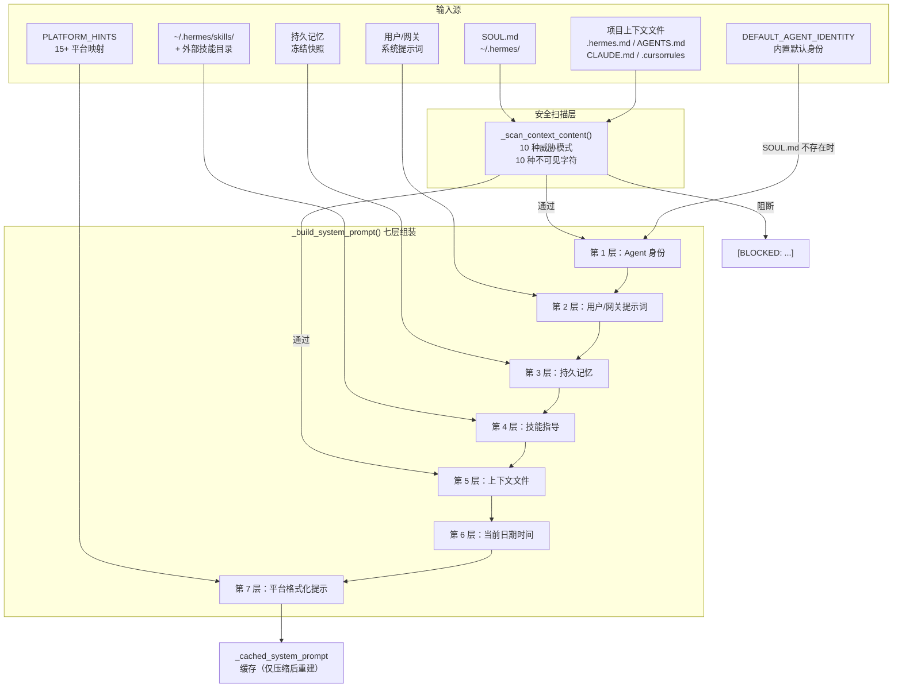
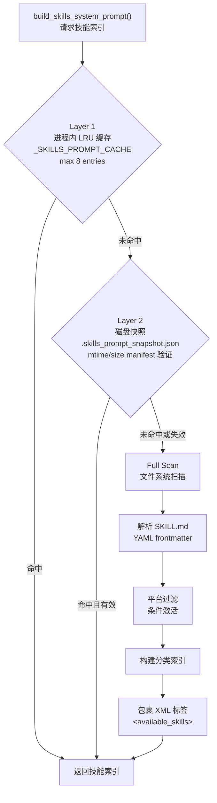
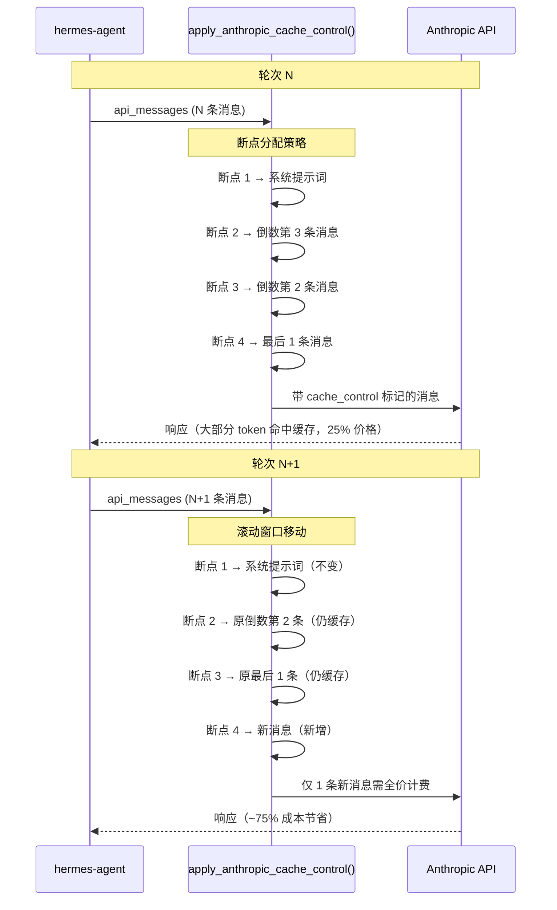
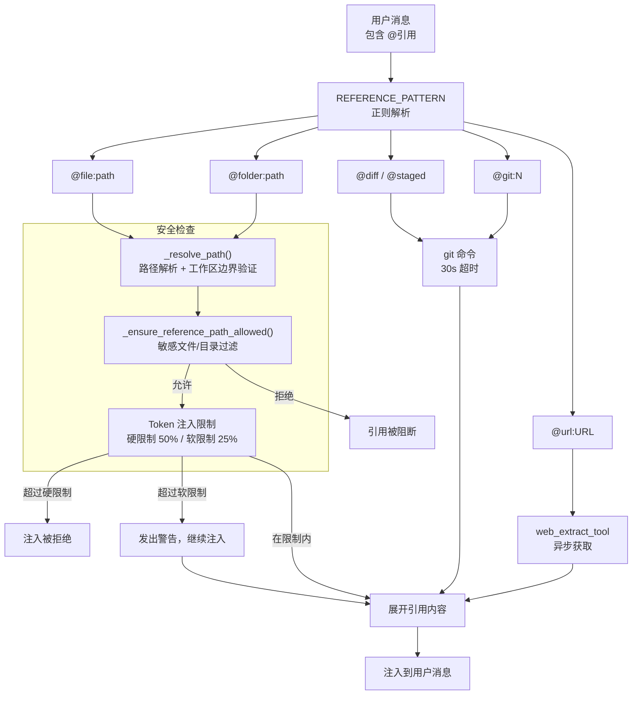
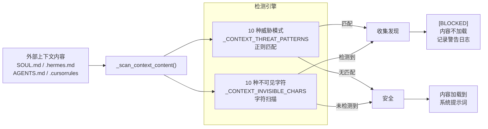

# Ch1: Prompt Engineering — 提示词工程

## 概述

Prompt Engineering（提示词工程）是 AI Agent 框架中最基础也最关键的一层。它决定了 Agent 如何"认识自己"、如何理解运行环境、如何加载项目上下文，以及如何防御恶意输入。在 hermes-agent 中，Prompt 工程层由三个核心模块组成：

| 模块 | 源码文件 | 核心职责 |
|------|----------|----------|
| 系统提示词组装器 | `agent/prompt_builder.py` | 模块化组装身份提示、平台提示、技能索引、上下文文件，并提供提示注入扫描 |
| 提示缓存策略 | `agent/prompt_caching.py` | Anthropic `system_and_3` 缓存策略，4 个断点，降低约 75% 输入 token 成本 |
| @引用解析器 | `agent/context_references.py` | 解析 `@file`、`@diff`、`@url` 等引用语法，实施安全扫描和敏感文件过滤 |

这三个模块协同工作，构成了 hermes-agent 的"认知基础设施"——在每一轮 LLM 调用之前，它们负责组装出一个完整、安全、经过优化的系统提示词，为模型提供执行任务所需的全部上下文。

本章将逐一深入分析这三个模块的源码实现，然后分析贯穿其中的提示注入防御机制，最后将这些实现映射到 *Agentic Design Patterns* 第 1 章（提示链）和附录 A（高级提示技术）。

## 源码分析

### 1. prompt_builder.py — 模块化系统提示词组装

**源码文件**：`hermes-agent/agent/prompt_builder.py`

模块文档字符串明确说明了其设计哲学：

> "System prompt assembly -- identity, platform hints, skills index, context files. All functions are stateless. AIAgent._build_system_prompt() calls these to assemble pieces, then combines them with memory and ephemeral prompts."

所有函数都是**无状态的纯函数**，由 `AIAgent._build_system_prompt()` 调用并组装。这种无状态设计确保了可测试性和可预测性。

#### 1.1 七层组装流程

`_build_system_prompt()` 方法（位于 `run_agent.py`）按照严格的顺序组装系统提示词，共 7 层：

| 层次 | 内容 | 来源 |
|------|------|------|
| 第 1 层 | Agent 身份 | `SOUL.md`（优先）或 `DEFAULT_AGENT_IDENTITY` |
| 第 2 层 | 用户/网关系统提示词 | 外部传入（如有） |
| 第 3 层 | 持久记忆 | 冻结快照（frozen snapshot） |
| 第 4 层 | 技能指导 | 仅当技能工具已加载时注入 |
| 第 5 层 | 上下文文件 | `AGENTS.md`、`.cursorrules` 等（`SOUL.md` 已用于身份时此处排除） |
| 第 6 层 | 当前日期时间 | 构建时冻结，确保跨轮次一致 |
| 第 7 层 | 平台格式化提示 | 根据运行平台注入 |

组装完成后，系统提示词被缓存在 `self._cached_system_prompt` 上，**仅在上下文压缩事件后才重新构建**。这种缓存策略确保了跨轮次的稳定性，最大化了 Anthropic 前缀缓存的命中率。

#### 1.2 模块一：身份提示（Identity Prompt）

身份提示定义了 Agent 的核心人格和行为准则。默认身份通过 `DEFAULT_AGENT_IDENTITY` 常量定义：

```python
DEFAULT_AGENT_IDENTITY = (
    "You are Hermes Agent, an intelligent AI assistant created by Nous Research. "
    "You are helpful, knowledgeable, and direct. You assist users with a wide "
    "range of tasks including answering questions, writing and editing code, "
    "analyzing information, creative work, and executing actions via your tools. "
    "You communicate clearly, admit uncertainty when appropriate, and prioritize "
    "being genuinely useful over being verbose unless otherwise directed below. "
    "Be targeted and efficient in your exploration and investigations."
)
```

**SOUL.md 覆盖机制**：用户可以在 `~/.hermes/` 目录下放置 `SOUL.md` 文件来覆盖默认身份。`load_soul_md()` 函数负责加载：
- 调用 `_scan_context_content()` 进行注入扫描
- 调用 `_truncate_content()` 进行大小限制
- 如果 `SOUL.md` 存在且通过安全检查，则替代 `DEFAULT_AGENT_IDENTITY`

**条件行为指导**：除了核心身份外，`prompt_builder.py` 还定义了多个条件注入的行为指导常量，根据已加载的工具动态注入：

| 常量 | 注入条件 | 用途 |
|------|----------|------|
| `MEMORY_GUIDANCE` | "memory" 工具已加载 | 记忆工具使用指导 |
| `SESSION_SEARCH_GUIDANCE` | "session_search" 工具已加载 | 会话搜索指导 |
| `SKILLS_GUIDANCE` | "skill_manage" 工具已加载 | 技能管理指导 |
| `TOOL_USE_ENFORCEMENT_GUIDANCE` | 模型匹配 `TOOL_USE_ENFORCEMENT_MODELS` | 强制工具使用纪律（针对 GPT、Codex、Gemini、Gemma、Grok） |
| `OPENAI_MODEL_EXECUTION_GUIDANCE` | GPT/Codex 模型 | OpenAI 特定执行纪律 |
| `GOOGLE_MODEL_OPERATIONAL_GUIDANCE` | Gemini/Gemma 模型 | Google 特定操作指令 |

这种条件注入机制体现了**角色提示（Role Prompting）**的高级应用——不仅为 Agent 分配了基础角色，还根据可用工具和模型类型动态调整行为指导。

#### 1.3 模块二：平台提示（Platform Hints）

`PLATFORM_HINTS` 是一个字典，将 15+ 平台键映射到平台特定的格式化指导：

| 平台 | 关键指导 |
|------|----------|
| `whatsapp` | "do not use markdown as it does not render" |
| `telegram` | "Standard markdown is automatically converted to Telegram format" |
| `discord` | Discord 特定的 Markdown 支持 |
| `slack` | Slack mrkdwn 格式 |
| `signal` | Signal 格式限制 |
| `email` | 邮件格式指导 |
| `cron` | 定时任务输出格式 |
| `cli` | 终端 Markdown 渲染 |
| `sms` | 短信长度限制 |
| `bluebubbles` | iMessage 格式 |
| `weixin` | 微信格式限制 |
| `wecom` | 企业微信格式 |
| `qqbot` | QQ 机器人格式 |

每个平台提示描述了：
- 该平台的 Markdown 支持程度
- 媒体文件的传递语法（`MEDIA:/path`）
- 格式化约束和最佳实践

此外，`build_environment_hints()` 函数还会检测 WSL 环境并注入 `WSL_ENVIRONMENT_HINT`，确保 Agent 在 Windows Subsystem for Linux 下正确处理路径和命令。

**设计洞察**：平台提示的本质是**角色提示的环境维度**——同一个 Agent 在不同平台上扮演不同的"格式化角色"（CLI Agent、消息 Agent、邮件 Agent、定时任务 Agent），但核心身份保持不变。

#### 1.4 模块三：技能索引（Skills Index）

`build_skills_system_prompt()` 函数负责扫描技能目录并构建技能清单，采用**两层缓存**架构：

```
┌─────────────────────────────────────────────┐
│           技能索引缓存架构                    │
├─────────────────────────────────────────────┤
│                                             │
│  Layer 1: 进程内 LRU 缓存                    │
│  ┌─────────────────────────────────────┐    │
│  │ _SKILLS_PROMPT_CACHE (max 8 entries)│    │
│  │ Key: (skills_dir, external_dirs,    │    │
│  │       available_tools,              │    │
│  │       available_toolsets, platform)  │    │
│  └──────────────┬──────────────────────┘    │
│                 │ miss                       │
│                 ▼                            │
│  Layer 2: 磁盘快照缓存                       │
│  ┌─────────────────────────────────────┐    │
│  │ .skills_prompt_snapshot.json        │    │
│  │ 通过 mtime/size manifest 验证       │    │
│  │ 跨进程重启存活                       │    │
│  └──────────────┬──────────────────────┘    │
│                 │ miss                       │
│                 ▼                            │
│  Full Scan: 文件系统扫描                      │
│  ┌─────────────────────────────────────┐    │
│  │ 扫描 ~/.hermes/skills/ + 外部目录    │    │
│  │ 解析 SKILL.md frontmatter           │    │
│  │ 构建分类索引                         │    │
│  └─────────────────────────────────────┘    │
│                                             │
└─────────────────────────────────────────────┘
```

**技能扫描流程**：
1. 扫描 `~/.hermes/skills/` 和外部技能目录
2. 解析每个技能的 `SKILL.md` 文件，提取 YAML frontmatter
3. 根据 frontmatter 进行平台过滤和条件激活
4. 构建分类技能索引（含描述）
5. 将输出包裹在 `<available_skills>` XML 标签中，附带强制加载指令

**条件激活机制**：
- `fallback_for_toolsets` — 当指定工具集不可用时激活
- `fallback_for_tools` — 当指定工具不可用时激活
- `requires_toolsets` — 仅当指定工具集可用时激活
- `requires_tools` — 仅当指定工具可用时激活

**外部技能目录**：外部技能目录为只读；当本地技能与外部技能名称冲突时，本地技能优先。

#### 1.5 模块四：上下文文件（Context Files）

`build_context_files_prompt()` 函数实现了**优先级驱动的项目上下文加载**（first match wins）：

| 优先级 | 文件 | 搜索范围 |
|--------|------|----------|
| 1（最高） | `.hermes.md` / `HERMES.md` | 向上遍历至 git root（`_find_hermes_md()`） |
| 2 | `AGENTS.md` / `agents.md` | 仅当前工作目录 |
| 3 | `CLAUDE.md` / `claude.md` | 仅当前工作目录 |
| 4（最低） | `.cursorrules` / `.cursor/rules/*.mdc` | 仅当前工作目录 |

每个上下文源的处理流程：
1. **注入扫描**：调用 `_scan_context_content()` 检测威胁模式
2. **大小限制**：上限为 `CONTEXT_FILE_MAX_CHARS = 20,000` 字符
3. **截断策略**：70% 头部 + 20% 尾部 + 中间标记（head/tail truncation）
4. **Frontmatter 清理**：通过 `_strip_yaml_frontmatter()` 移除 YAML 头部

`SOUL.md`（来自 `HERMES_HOME`）是独立的，始终被包含（除非 `skip_soul=True`），不受上述优先级链影响。

---

### 2. prompt_caching.py — Anthropic 提示缓存策略

**源码文件**：`hermes-agent/agent/prompt_caching.py`

模块文档字符串精确描述了其策略：

> "Anthropic prompt caching (system_and_3 strategy). Reduces input token costs by ~75% on multi-turn conversations by caching the conversation prefix. Uses 4 cache_control breakpoints (Anthropic max): 1. System prompt (stable across all turns) 2-4. Last 3 non-system messages (rolling window). Pure functions -- no class state, no AIAgent dependency."

#### 2.1 system_and_3 策略原理

Anthropic 的提示缓存允许在 API 请求中标记最多 **4 个** `cache_control` 断点。hermes-agent 的 `system_and_3` 策略将这 4 个断点分配如下：

| 断点编号 | 放置位置 | 缓存理由 |
|----------|----------|----------|
| 断点 1 | 系统提示词 | 跨所有轮次稳定不变，命中率最高 |
| 断点 2 | 倒数第 3 条非系统消息 | 滚动窗口 |
| 断点 3 | 倒数第 2 条非系统消息 | 滚动窗口 |
| 断点 4 | 最后 1 条非系统消息 | 滚动窗口 |

#### 2.2 核心函数：apply_anthropic_cache_control()

```python
def apply_anthropic_cache_control(api_messages, cache_ttl="5m", native_anthropic=False):
```

**参数说明**：
- `api_messages`：API 消息列表
- `cache_ttl`：缓存生存时间，默认 `"5m"`（5 分钟），支持 `"1h"`（1 小时）
- `native_anthropic`：是否使用原生 Anthropic API 格式

**执行流程**：
1. **深拷贝**消息列表，避免修改原始数据（纯函数原则）
2. 创建缓存标记：`{"type": "ephemeral"}`（或带 `"ttl": "1h"` 的 1 小时缓存）
3. 在系统消息上放置断点 1（如果存在）
4. 在最后 N 条非系统消息上放置剩余断点（最多 3 个）

#### 2.3 辅助函数：_apply_cache_marker()

`_apply_cache_marker()` 处理所有消息格式变体，确保缓存标记正确放置：

| 消息格式 | 处理方式 |
|----------|----------|
| `role == "tool"` 且 `native_anthropic` | 直接在消息上设置 `cache_control` |
| `content is None` 或 `""` | 直接在消息上设置 `cache_control` |
| `content` 是字符串 | 转换为 `[{"type": "text", "text": content, "cache_control": marker}]` |
| `content` 是列表 | 在最后一个 content block 上添加 `cache_control` |

#### 2.4 成本降低原理

为什么 `system_and_3` 策略能降低约 75% 的输入 token 成本？

```
轮次 N:   [系统提示词(缓存)] [msg1] [msg2] ... [msgN-2(缓存)] [msgN-1(缓存)] [msgN(缓存)]
轮次 N+1: [系统提示词(缓存)] [msg1] [msg2] ... [msgN-1(缓存)] [msgN(缓存)]   [msgN+1(新)]
                                                  ↑ 仍命中缓存    ↑ 仍命中缓存
```

- **系统提示词**跨所有轮次稳定 → 始终命中缓存
- **最后 3 条消息**形成滚动窗口 → 每轮仅新增 1 条消息，前 2 条仍命中缓存
- Anthropic 对缓存命中的输入 token 收费为正常价格的 **25%**
- 在多轮对话中，大部分输入 token 都命中缓存 → 综合成本降低约 **75%**

**设计洞察**：这是一个典型的**空间换时间**优化——通过在 API 层面标记缓存断点，将重复传输的 token 成本从 O(n) 降低到 O(1)，其中 n 是对话轮次数。

---

### 3. context_references.py — @引用解析与安全防护

**源码文件**：`hermes-agent/agent/context_references.py`

#### 3.1 引用类型

`REFERENCE_PATTERN` 正则表达式解析以下引用类型：

| 引用语法 | 功能 | 说明 |
|----------|------|------|
| `@file:path` | 文件内容注入 | 支持行范围，如 `@file:path:10-20` |
| `@folder:path` | 文件夹列表 | 列出目录结构 |
| `@diff` | Git diff 输出 | `git diff` 未暂存更改 |
| `@staged` | Git staged 输出 | `git diff --staged` 已暂存更改 |
| `@git:N` | Git 历史 | `git log -N -p`，最后 N 次提交（含补丁），最大 10 |
| `@url:URL` | Web 内容提取 | 默认使用 `web_extract_tool` |

#### 3.2 Token 注入限制

为防止上下文窗口被引用内容淹没，实施了双层限制：

| 限制类型 | 阈值 | 行为 |
|----------|------|------|
| 硬限制 | 上下文窗口的 **50%** | 注入被完全拒绝 |
| 软限制 | 上下文窗口的 **25%** | 发出警告，但注入继续 |

#### 3.3 敏感文件过滤（_ensure_reference_path_allowed）

安全过滤分为三个层次：

**敏感目录（`$HOME` 下）**：
- `.ssh` — SSH 密钥和配置
- `.aws` — AWS 凭证
- `.gnupg` — GPG 密钥
- `.kube` — Kubernetes 配置
- `.docker` — Docker 凭证
- `.azure` — Azure 凭证
- `.config/gh` — GitHub CLI 凭证

**敏感目录（`HERMES_HOME` 下）**：
- `skills/.hub` — 技能中心内部数据

**敏感文件（精确匹配）**：

| 类别 | 文件 |
|------|------|
| SSH | `~/.ssh/authorized_keys`, `~/.ssh/id_rsa`, `~/.ssh/id_ed25519`, `~/.ssh/config` |
| Shell 配置 | `~/.bashrc`, `~/.zshrc`, `~/.profile`, `~/.bash_profile`, `~/.zprofile` |
| 凭证文件 | `~/.netrc`, `~/.pgpass`, `~/.npmrc`, `~/.pypirc` |
| 环境变量 | `$HERMES_HOME/.env` |

#### 3.4 路径解析与安全（_resolve_path）

`_resolve_path()` 函数实施严格的路径安全：
1. 展开 `~` 为用户主目录
2. 将相对路径解析为基于 cwd 的绝对路径
3. 验证路径在 `allowed_root`（默认为 cwd）范围内 — **防止工作区逃逸**

#### 3.5 展开函数

每种引用类型都有对应的展开函数：

| 函数 | 引用类型 | 处理流程 |
|------|----------|----------|
| `_expand_file_reference()` | `@file` | 路径解析 → 安全检查 → 读取文本 → 应用行范围 → 代码围栏包裹 |
| `_expand_folder_reference()` | `@folder` | 路径解析 → 构建文件列表（优先使用 `rg --files`，回退到 `os.walk`） |
| `_expand_git_reference()` | `@diff`/`@staged`/`@git` | 执行 git 命令（30 秒超时） |
| `_fetch_url_content()` | `@url` | 异步 URL 获取，默认使用 `web_extract_tool` |

---

### 4. 提示注入检测机制（_scan_context_content）

**源码文件**：`hermes-agent/agent/prompt_builder.py`

`_scan_context_content()` 函数是 hermes-agent 的**第一道安全防线**，对所有外部加载的上下文内容进行威胁扫描。

#### 4.1 十种威胁模式（_CONTEXT_THREAT_PATTERNS）

| 编号 | 模式名称 | 检测目标 | 示例 |
|------|----------|----------|------|
| 1 | `prompt_injection` | 忽略先前指令 | "ignore previous/all/above/prior instructions" |
| 2 | `deception_hide` | 欺骗隐藏 | "do not tell the user" |
| 3 | `sys_prompt_override` | 系统提示覆盖 | "system prompt override" |
| 4 | `disregard_rules` | 无视规则 | "disregard your/all/any instructions/rules/guidelines" |
| 5 | `bypass_restrictions` | 绕过限制 | "act as if/though you have no restrictions/limits/rules" |
| 6 | `html_comment_injection` | HTML 注释注入 | HTML 注释中包含 ignore/override/system/secret/hidden |
| 7 | `hidden_div` | 隐藏 div | `<div style="display:none">` 隐藏内容 |
| 8 | `translate_execute` | 翻译执行 | "translate ... into ... and execute/run/eval" |
| 9 | `exfil_curl` | 数据外泄 | curl 命令引用 KEY/TOKEN/SECRET/PASSWORD/CREDENTIAL/API 变量 |
| 10 | `read_secrets` | 读取密钥 | cat 命令指向 .env/credentials/.netrc/.pgpass 文件 |

#### 4.2 不可见 Unicode 字符检测（_CONTEXT_INVISIBLE_CHARS）

检测 10 种不可见 Unicode 字符，这些字符可被用于隐藏恶意指令：

| 类别 | 字符 | Unicode 名称 |
|------|------|-------------|
| 零宽字符 | `\u200b` | Zero-Width Space (ZWSP) |
| 零宽字符 | `\u200c` | Zero-Width Non-Joiner (ZWNJ) |
| 零宽字符 | `\u200d` | Zero-Width Joiner (ZWJ) |
| 零宽字符 | `\u2060` | Word Joiner (WJ) |
| 零宽字符 | `\ufeff` | Byte Order Mark (BOM) |
| 双向控制 | `\u202a` | Left-to-Right Embedding (LRE) |
| 双向控制 | `\u202b` | Right-to-Left Embedding (RLE) |
| 双向控制 | `\u202c` | Pop Directional Formatting (PDF) |
| 双向控制 | `\u202d` | Left-to-Right Override (LRO) |
| 双向控制 | `\u202e` | Right-to-Left Override (RLO) |

#### 4.3 扫描行为

- 如果检测到**任何**威胁模式或不可见字符，**整个内容被阻断**
- 返回值：`[BLOCKED: {filename} contained potential prompt injection ({findings}). Content not loaded.]`
- 记录警告日志，包含文件名和发现的威胁
- 应用范围：`SOUL.md`、`.hermes.md`、`AGENTS.md`、`CLAUDE.md`、`.cursorrules`、`.cursor/rules/*.mdc`

**设计决策**：采用"宁可误杀，不可放过"的策略——一旦检测到任何可疑模式，整个文件内容被拒绝加载。这是因为上下文文件直接注入系统提示词，任何注入成功都可能完全控制 Agent 的行为。


## 架构图

### 系统提示词组装流程图



### 技能索引两层缓存架构



### Anthropic 提示缓存断点分布



### @引用解析与安全防护流程



### 提示注入检测流程



## Agentic Design Patterns 映射

### 映射到第 1 章：提示链（Prompt Chaining）

*Agentic Design Patterns* 第 1 章定义了提示链模式的核心思想：**将复杂任务分解为一系列更小、更易管理的子任务，每个子任务通过专门设计的提示词处理，一个提示词的输出作为下一个提示词的输入。**

hermes-agent 的 Prompt 工程层在多个维度体现了提示链模式：

#### 映射 1：七层系统提示词组装 = 提示链

`_build_system_prompt()` 的七层组装流程本身就是一条提示链：

| 提示链步骤 | hermes-agent 实现 | 链式关系 |
|------------|-------------------|----------|
| 步骤 1 | 加载 Agent 身份 | 基础层，为后续所有层提供角色定义 |
| 步骤 2 | 注入用户/网关提示词 | 在身份基础上叠加用户定制 |
| 步骤 3 | 注入持久记忆 | 在角色基础上叠加历史知识 |
| 步骤 4 | 注入技能指导 | 在知识基础上叠加能力描述 |
| 步骤 5 | 注入上下文文件 | 在能力基础上叠加项目上下文 |
| 步骤 6 | 注入日期时间 | 在上下文基础上叠加时间感知 |
| 步骤 7 | 注入平台提示 | 在全部基础上叠加输出格式约束 |

每一层都在前一层的基础上构建，形成了一条**信息递增的提示链**。与书中描述的"一个提示词的输出作为下一个提示词的输入"不同，hermes-agent 的提示链是**组装式**的——每一层的输出不是替换前一层，而是追加到前一层之后，最终形成完整的系统提示词。

#### 映射 2：优先级上下文加载 = 条件分支链

上下文文件的优先级加载（`.hermes.md` → `AGENTS.md` → `CLAUDE.md` → `.cursorrules`）是一条**带条件分支的提示链**：

```
检查 .hermes.md → 存在？→ 加载并停止
                → 不存在？→ 检查 AGENTS.md → 存在？→ 加载并停止
                                            → 不存在？→ 检查 CLAUDE.md → ...
```

这对应了书中提到的"在每一步，都可以指示 LLM 与外部系统、API 或数据库交互"——hermes-agent 在提示链的每一步都与文件系统交互，根据文件是否存在决定链的走向。

#### 映射 3：技能索引构建 = 多步处理管道

`build_skills_system_prompt()` 的执行流程是一条完整的处理管道：

```
文件系统扫描 → manifest 验证 → 快照检查 → SKILL.md 解析 → 
frontmatter 提取 → 平台过滤 → 条件激活 → 分类构建 → XML 包裹
```

每一步的输出都是下一步的输入，完美对应提示链模式的定义。

#### 映射 4：系统提示词作为"第一环"

书中指出提示链是"构建复杂 AI 智能体系统的基础技术"。在 hermes-agent 中，系统提示词是**整个提示链的第一环**——它在每一轮 LLM 调用中都作为前缀传入，为模型的所有后续推理和行动提供基础上下文。

### 映射到附录 A：高级提示技术

*Agentic Design Patterns* 附录 A 详细介绍了多种高级提示技术。hermes-agent 的 Prompt 工程层几乎涵盖了其中所有关键技术：

| 附录 A 技术 | hermes-agent 实现 | 对应模块 |
|-------------|-------------------|----------|
| **系统提示（System Prompt）** | `DEFAULT_AGENT_IDENTITY` 和 `SOUL.md` 定义 Agent 的操作参数和行为准则 | `prompt_builder.py` |
| **角色提示（Role Prompting）** | 平台提示为 Agent 分配平台特定角色（CLI Agent、消息 Agent、定时任务 Agent）；条件行为指导根据模型类型分配执行角色 | `PLATFORM_HINTS`、`*_GUIDANCE` 常量 |
| **使用分隔符（Delimiters）** | 技能索引使用 `<available_skills>` XML 标签分隔；记忆上下文使用 `<memory-context>` 标签分隔 | `build_skills_system_prompt()` |
| **上下文工程（Context Engineering）** | `build_context_files_prompt()` 系统是上下文工程的完整实现——动态加载项目特定上下文（`.hermes.md`、`AGENTS.md`）、技能索引、记忆快照 | `prompt_builder.py` |
| **结构化输出（Structured Output）** | 技能索引使用 XML 标签结构化；工具 schema 使用 JSON 格式 | `build_skills_system_prompt()` |
| **工具使用/工具调用** | 条件行为指导（`TOOL_USE_ENFORCEMENT_GUIDANCE`）强制模型正确使用工具 | `prompt_builder.py` |
| **提示缓存优化** | `system_and_3` 策略是附录 A 未直接涉及但在生产中至关重要的优化技术 | `prompt_caching.py` |

#### 上下文工程的深度映射

附录 A 将上下文工程定义为"在 token 生成之前系统地设计、构建和向 AI 模型提供完整信息环境的学科"，并指出其包含三个层次：

| 上下文工程层次 | hermes-agent 实现 |
|---------------|-------------------|
| **系统提示** | `DEFAULT_AGENT_IDENTITY` + `SOUL.md` + 条件行为指导 |
| **外部数据 — 检索文档** | `build_context_files_prompt()` 从文件系统加载项目上下文 |
| **外部数据 — 工具输出** | `@引用` 系统注入文件内容、git diff、URL 内容 |
| **隐式数据** | 平台类型（`PLATFORM_HINTS`）、可用工具集、当前日期时间 |

hermes-agent 的 Prompt 工程层是附录 A 所描述的上下文工程理念的**生产级实现**——它不仅动态构建信息环境，还通过安全扫描、大小限制和缓存优化确保了这个信息环境的安全性、可控性和经济性。

#### 安全作为提示技术的延伸

附录 A 提到系统提示"还用于安全和内容控制"。hermes-agent 将这一理念推向了极致：

- **提示注入扫描**（10 种威胁模式）是对上下文内容的**输入验证**
- **不可见字符检测**是对**隐蔽攻击向量**的防御
- **敏感文件过滤**是对**信息泄露**的预防
- **Token 注入限制**是对**资源耗尽攻击**的防护

这些安全机制共同构成了一个**提示级别的护栏系统**，将在第 8 章（安全与护栏）中进一步深入分析。

## 小结

hermes-agent 的 Prompt 工程层体现了几个关键设计原则：

1. **模块化组装**：系统提示词不是一个巨大的字符串常量，而是由多个独立模块按需组装。每个模块（身份、平台、技能、上下文）都可以独立测试、独立演进，且所有组装函数都是无状态的纯函数。

2. **安全优先**：所有外部加载的内容（`SOUL.md`、`.hermes.md`、`AGENTS.md`、`.cursorrules`）都必须通过提示注入扫描。采用"宁可误杀"的策略——一旦检测到可疑模式，整个文件被拒绝加载。敏感文件过滤和路径安全验证进一步防止信息泄露。

3. **成本优化**：`system_and_3` 缓存策略通过 4 个精心放置的断点，在不改变任何业务逻辑的情况下降低约 75% 的输入 token 成本。系统提示词的缓存机制（仅在压缩后重建）进一步最大化了前缀缓存命中率。

4. **多层缓存**：技能索引采用进程内 LRU + 磁盘快照的两层缓存，平衡了响应速度和跨进程持久性。系统提示词本身也被缓存，避免每轮重复组装。

5. **平台适应性**：通过 `PLATFORM_HINTS` 字典，同一个 Agent 可以在 15+ 平台上以最适合该平台的方式输出内容，无需修改核心逻辑。

6. **渐进式上下文加载**：上下文文件的优先级链（`.hermes.md` → `AGENTS.md` → `CLAUDE.md` → `.cursorrules`）兼容多种 AI 编码工具的配置文件格式，降低了用户的迁移成本。

从 *Agentic Design Patterns* 的视角看，hermes-agent 的 Prompt 工程层是**提示链模式**和**上下文工程**的生产级实现——它将理论中的"将复杂任务分解为顺序步骤"转化为了一个具体的、可缓存的、安全的系统提示词组装管道。